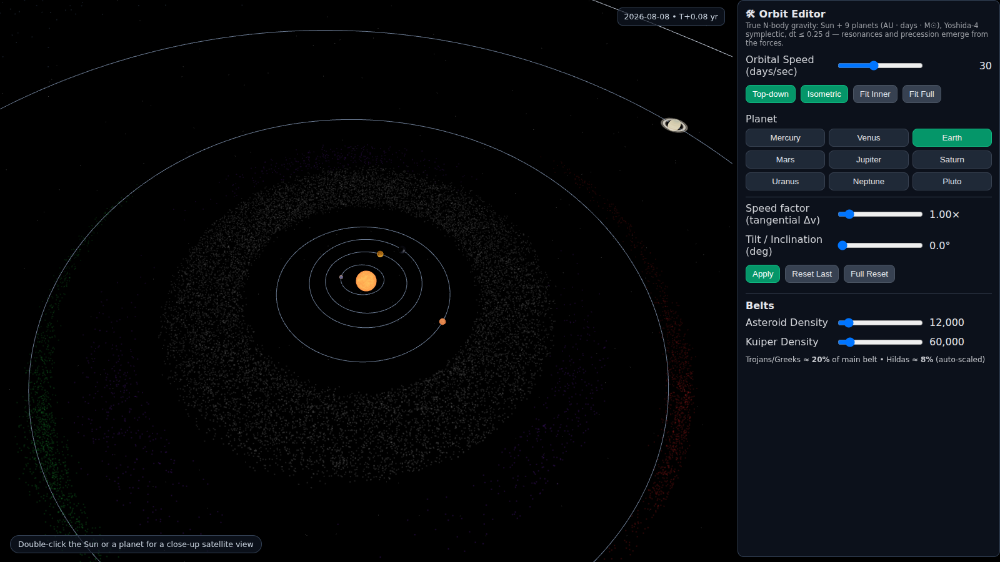
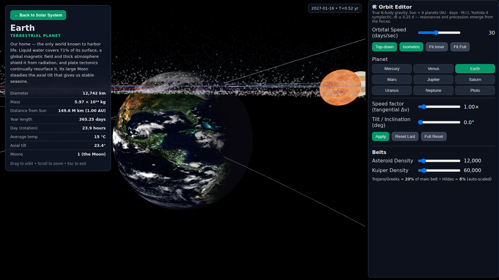
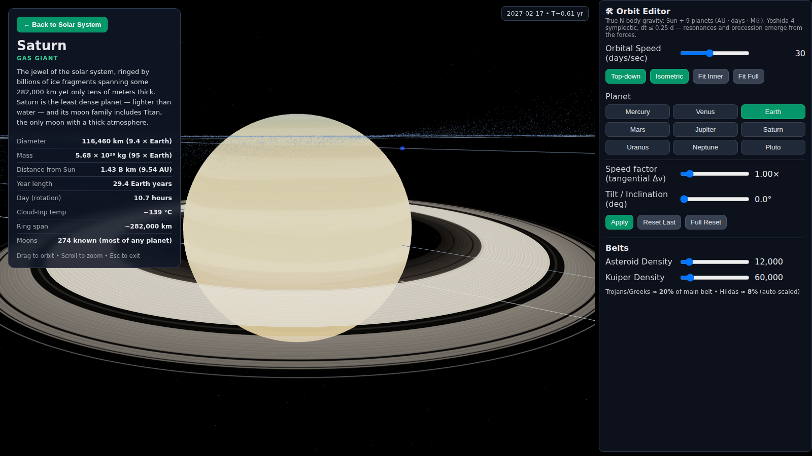

# Solar Harmonics Console

An interactive 3D solar system running on a **true N-body gravitational physics engine** — every planet's motion is computed from real gravitational forces, not animation curves. Built with Three.js, React, and Vite.

**▶ Live demo:** https://mecca-research.github.io/SolarHarmonicsConsole/



## Features

### Real physics, not rails

The Sun and all nine planets (yes, Pluto rides along) are integrated under full pairwise Newtonian gravity:

- **Units:** AU / days / solar masses, where the gravitational constant is exactly the square of the Gaussian gravitational constant: G = 0.0002959122083 AU³/(M☉·day²)
- **Integrator:** 4th-order Yoshida symplectic with ≤ 0.25-day substeps — energy drift is ~3×10⁻¹¹ per simulated century, so the system stays stable indefinitely
- **Initial conditions:** state vectors derived from JPL's published J2000 osculating elements + centennial rates, evaluated at epoch 2026-07-10 and shifted to the zero-momentum barycentric frame

Because the forces are real, the classic orbital mechanics **emerge on their own**: Pluto's 3:2 resonance with Neptune keeps the two at least 20 AU apart even though Pluto crosses inside Neptune's orbit, Mercury's perihelion precesses from planetary perturbations, and the live orbit lines (osculating ellipses recomputed from the state vectors) visibly reshape and precess over time. A HUD chip shows the simulated calendar date.

### Explore every world

**Double-click the Sun or any planet** to fly into a close-up satellite view: the camera glides in cinematically, slowly orbits the body while it rotates about its own (correctly tilted) axis, and an info panel shows real stats — diameter, mass, orbital period, temperature, moons, and more. Drag to orbit, scroll to zoom, Esc or the Back button to return.

| Earth | Saturn |
|---|---|
|  |  |

Planet surfaces are modeled on NASA reference imagery — MESSENGER enhanced-color Mercury, Magellan radar Venus, the Cassini Saturn portrait (with C/B/A ring structure, the Cassini Division, Encke and Keeler gaps, and the thin F ring), Keck Uranus, and Voyager 2 Neptune with its Great Dark Spot.

### Orbit editor

Perturb the system yourself: apply a **tangential Δv** to any planet (a real velocity change — the new orbit then evolves under gravity like everything else), tilt its orbital plane, and watch the consequences ripple. Reset a planet or the whole system back to the epoch state at any time. Asteroid belt, Kuiper belt, and Jupiter's Trojan/Hilda swarms are rendered as tens of thousands of decorative test particles.

## GitHub Pages deployment

The repo root contains a pre-built copy of the app (`index.html`, `assets/`, `.nojekyll`) so it deploys straight from the default branch:

1. Repo **Settings → Pages → Build and deployment**
2. Source: **Deploy from a branch**
3. Branch: **main**, folder: **/ (root)** → Save

The site publishes at `https://<owner>.github.io/SolarHarmonicsConsole/`.

To rebuild the deployed site after changing the app:

```bash
pnpm run build:pages   # builds artifacts/solar-sim and refreshes /index.html + /assets
```

(The build is generated with `BASE_PATH=/SolarHarmonicsConsole/`; if you fork under a different repo name, change `BASE_PATH` in the root `package.json` `build:pages` script to `/<your-repo-name>/`.)

## Development

This is a pnpm workspace monorepo (Node 24, TypeScript 5.9). The simulation lives in `artifacts/solar-sim`; the physics engine is `artifacts/solar-sim/src/nbody.ts`.

```bash
pnpm install

# dev server (env vars are required by the Vite config)
PORT=5199 BASE_PATH=/ pnpm --filter @workspace/solar-sim run dev

# typecheck everything
pnpm run typecheck
```

| Path | What it is |
|---|---|
| `artifacts/solar-sim/src/nbody.ts` | N-body engine: element→state-vector setup, Yoshida-4 symplectic integrator, osculating-element extraction |
| `artifacts/solar-sim/src/SolarConsole3d.tsx` | The Three.js scene: rendering, procedural planet textures, camera/focus system, orbit editor UI |
| `artifacts/api-server`, `lib/*` | Express API scaffold and shared libraries (not used by the simulation) |

**Physics scale vs. visual scale:** the engine state stays in true units (AU) and is never touched by the renderer; the render loop maps heliocentric ecliptic coordinates into scene space with a ×30 visual multiplier and exaggerated planet spheres so everything is actually visible.
